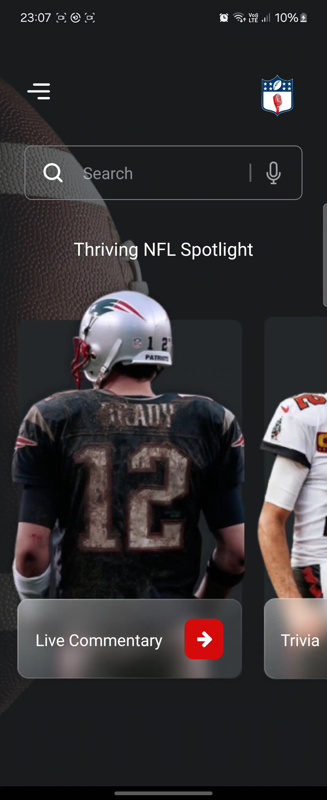
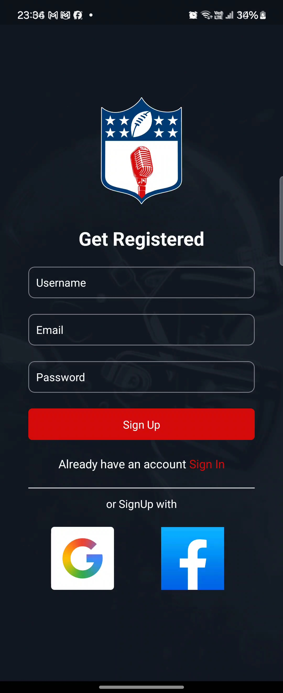
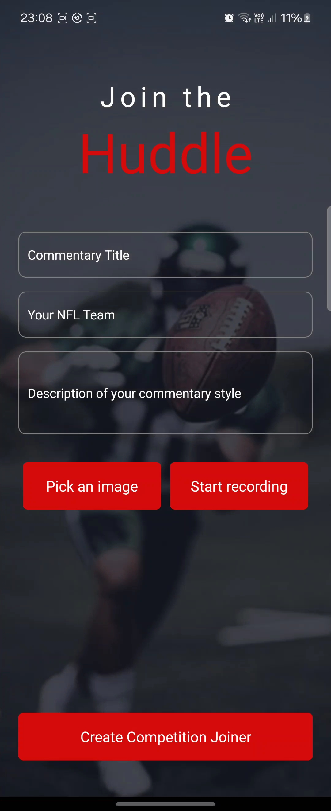
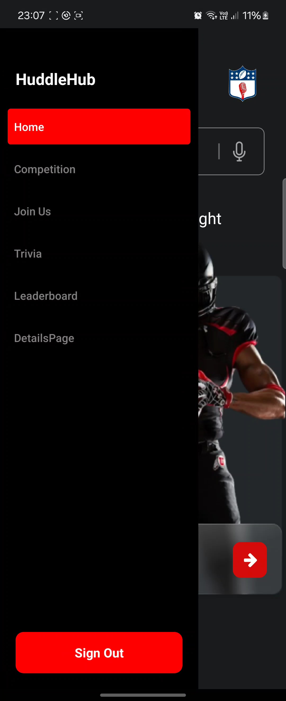

<div align="center">

</div>

<div align="center">
  <br>
  <h1>Huddle Hub 🏈</h1>
</div>
<br>


## Use To Code


<br/>

## About our term project?

Huddle Hub is your go-to app for immersive NFL experiences. From live match commentary to interactive challenges, this app brings the thrill of the game right to your fingertips. Engage with fellow fans, showcase your football knowledge, and vie for the top spot in our exciting competitions. ❤️

## Table of Contents

- [Features](#features)
- [Screenshots](#screenshots)
- [Installation](#installation)
  - [Prerequisites](#prerequisites)
  - [Clone the Repository](#clone-the-repository)
  - [Build the Application](#build-the-application)
  - [Run the Application](#run-the-application)
- [Usage](#usage)
- [Contributing](#contributing)
  - [Fork the Project](#fork-the-project)
- [License](#license)
- [Acknowledgements](#acknowledgements)

## App Features and Functionalities

1. **Authentication:**
   - Sign up functionality.
   - Sign in functionality.
   - Sign out functionality.

2. **Navigation:**
   - Drawer navigation with screens like Home, Competition, Join Us, Trivia, Leaderboard, and DetailsPage.
   - Stack navigation for handling screens like SignUp, Login, and DetailsPage.

3. **UI Elements:**
   - Custom drawer content with a "Sign Out" button.
   - Stylish design with background images, buttons, and text inputs.

4. **Data Handling:**
   - Creation of competition users with title, priority, due date, description, image, and recording.
   - Displaying competition users with details and comments.

5. **Audio Features:**
   - Recording and playing audio for competition users.
   - Like functionality for comments.

6. **Miscellaneous:**
   - Modal for displaying most liked comment.
   - Integration with Firebase for authentication and database operations.

   ## Screenshots

Here are some screenshots that showcase the features and user interface of HuddleHub:


*Home Screen - Where users can navigate through different features.*


*Login Screen - Users can log in to access their accounts.*


*Competition Screen - View and join current competitions.*


*Drawer Screen - Navigation through the whole app.*
   

### Getting Started

## Installation

To set up your React Native mobile development project for HuddleHub using Visual Studio Code, follow these steps:

1. **Prerequisites:**
   - Visual Studio Code
   - Git

2. **Clone the Repository:**
   - Open your terminal.
   - Run the following command:
     ```
     git clone https://github.com/your-username/HuddleHub.git
     ```
   - Open the project in Visual Studio Code.
   - Install all dependencies by running `npm install`.

3. **Build the Application:**
   - Start the development server by running `npm start`.
   - Launch the application on your device or emulator using Expo Go app.
   - Follow the on-screen instructions to view the app on your device.

### Fork the Project

1. Create your Feature Branch (git checkout -b feature/AmazingFeature)
2. Commit your Changes (git commit -m 'Add some AmazingFeature')
3. Push to the Branch (git push origin feature/AmazingFeature)
4. Open a Pull Request

## Usage

After installing HuddleHub on your device, follow these steps to start using the app:

1. **Open the App:**
   - Tap on the HuddleHub icon on your device's home screen to launch the app.

2. **Sign Up or Log In:**
   - If you're a new user, sign up by entering your details and following the prompts.
   - If you already have an account, log in with your credentials.

3. **Explore the Features:**
   - Navigate through the app using the drawer menu to access different features like Home, Competition, Trivia, and Leaderboard.

4. **Participate in Competitions:**
   - Join competitions, submit your entries, and check updates on ongoing competitions.

5. **Check Leaderboard:**
   - View the leaderboard to see top scores and rankings from various competitions.

6. **Update Profile:**
   - Customize your profile settings and manage your account details.

For more detailed instructions, refer to the help section within the app or visit our official website.

## Acknowledgements

We would like to acknowledge the following entities for their contributions and support:

- React Native Documentation: For providing comprehensive guides and API references.
- Expo Documentation: For detailed instructions on using Expo to manage React Native applications.
- Udacity and Udemy: For their React Native courses that provided essential knowledge and skills.
- Open-Source Libraries: Such as React Navigation and Redux, for enhancing our app's functionality.
- Stack Overflow and GitHub: For community support and collaboration tools.
- Lecturer [Armand Pretorius]: For invaluable guidance and feedback.
- Material-UI: For design guidelines and ready-to-use components that improved our UI design.
- GitHub: For hosting the repository and facilitating version control.

## License

Distributed under the MIT License. See LICENSE for more information.

<br>

## Youtube Tutorial Link

 Basic Android Studio Tutorial link: [https://youtu.be/INTPHa0GW3Q](https://youtu.be/yB3EnDO0fnU)https://youtu.be/yB3EnDO0fnU

